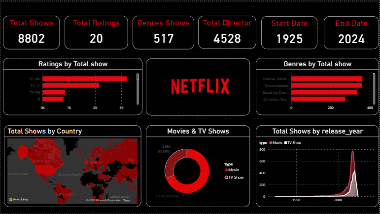

# 🎬 Netflix Dashboard – Power BI  

This project is an **interactive Power BI dashboard** that provides insights into Netflix’s movies and TV shows dataset. It allows users to analyze content distribution, genres, ratings, and trends in an intuitive and visual manner.  

## 📌 Features  
- 📊 **Content Overview** – Total movies & TV shows, yearly additions, and trends  
- 🎭 **Genre Analysis** – Most popular genres, categories, and sub-categories  
- 🌍 **Geographic Insights** – Content distribution by country/region  
- ⭐ **Ratings Breakdown** – Audience ratings across movies & shows  
- 🗓️ **Time Trends** – Release year vs. content type analysis  
- 🔍 **Interactive Filters** – Filter by year, genre, rating, or country  

## 🛠️ Tools & Technologies  
- **Power BI Desktop** (Dashboard & Data Modeling)  
- **DAX (Data Analysis Expressions)**  
- **Data Cleaning** (Power Query)  
- **Netflix Movies & TV Shows Dataset** (publicly available from Kaggle or other sources)  

## 📂 File Structure  
Netflix Dashboard.pbix    # Power BI dashboard file
README.md                 # Project documentation

## 🚀 How to Use  
1. Download the repository or clone it.  
2. Open `Netflix Dashboard.pbix` in **Power BI Desktop**.  
3. Explore the interactive reports and apply filters as needed.  

## 📈 Insights from the Dashboard  
- The number of movies dominates compared to TV shows.  
- The U.S. and India contribute the highest number of Netflix titles.  
- Dramas and Documentaries are among the most popular genres.  
- Content production increased significantly after 2015.  

## 📊 Sample Dashboard Preview  
  

## 📌 Future Improvements  
- Add **sentiment analysis** on Netflix descriptions.  
- Integrate **IMDb ratings** for deeper insights.  
- Publish the dashboard to **Power BI Service** for online access.  
